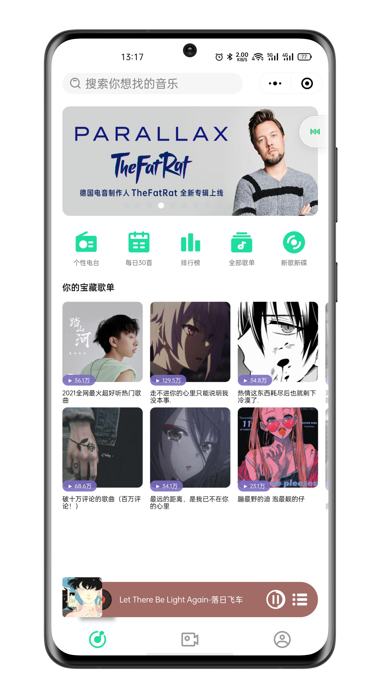
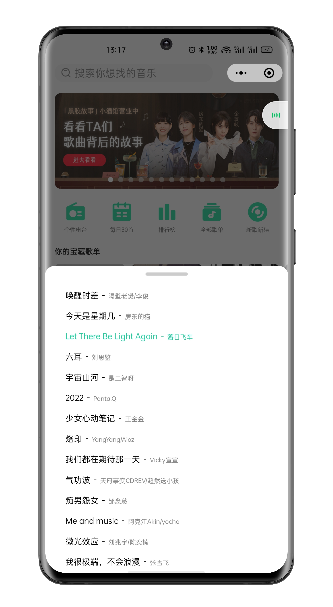
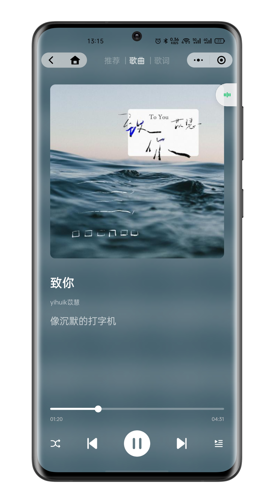
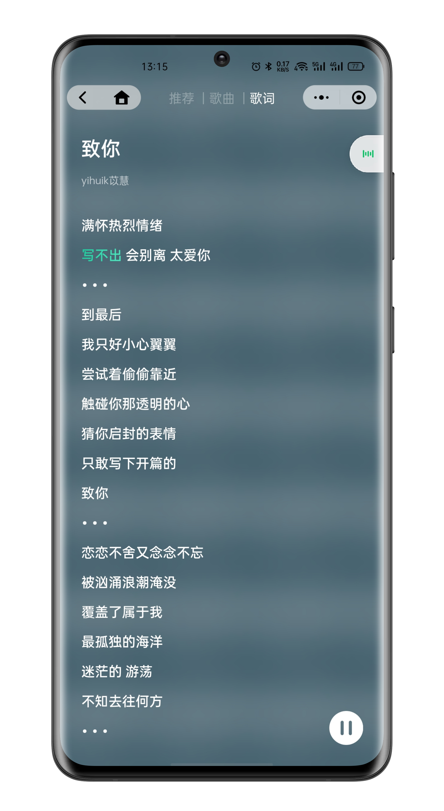
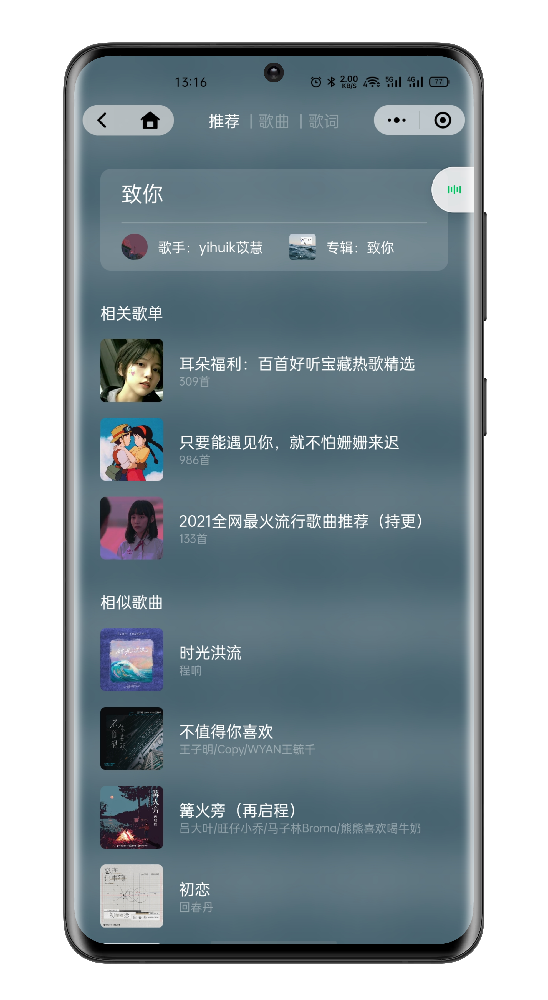
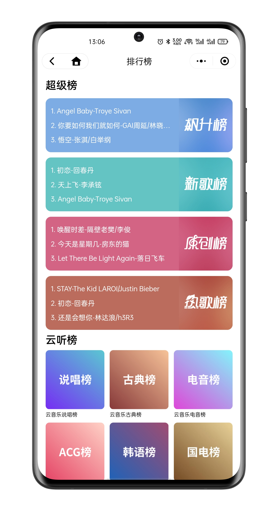
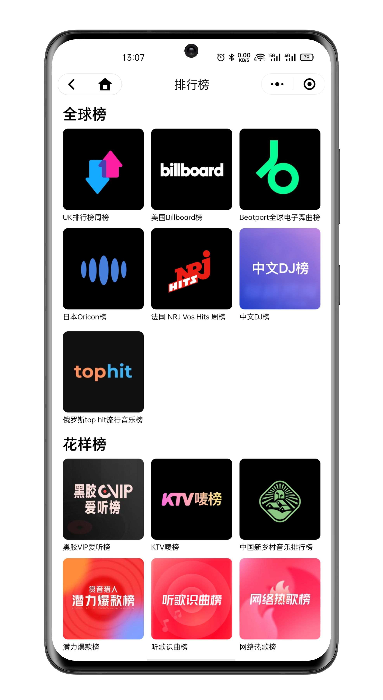
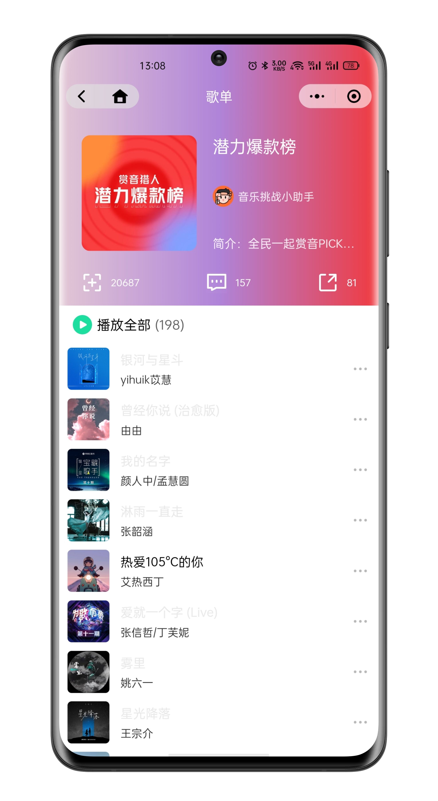

# Ping Music Mobile📻 (微信小程序)
>🎤 一款第三方网易云音乐播放器  
>🎼 采用 Vue 3 + Taro 开发  
>🔊 API来自 [Binaryify/NeteaseCloudMusicApi](https://github.com/Binaryify/NeteaseCloudMusicApi)  
>🎧 UI借鉴 QQ音乐简洁版
---
 

# 🌈 效果预览

